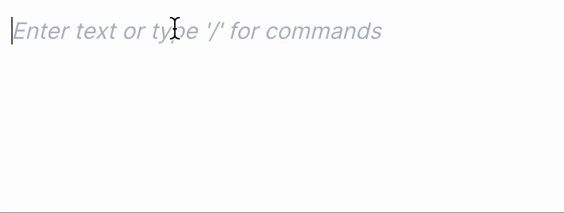
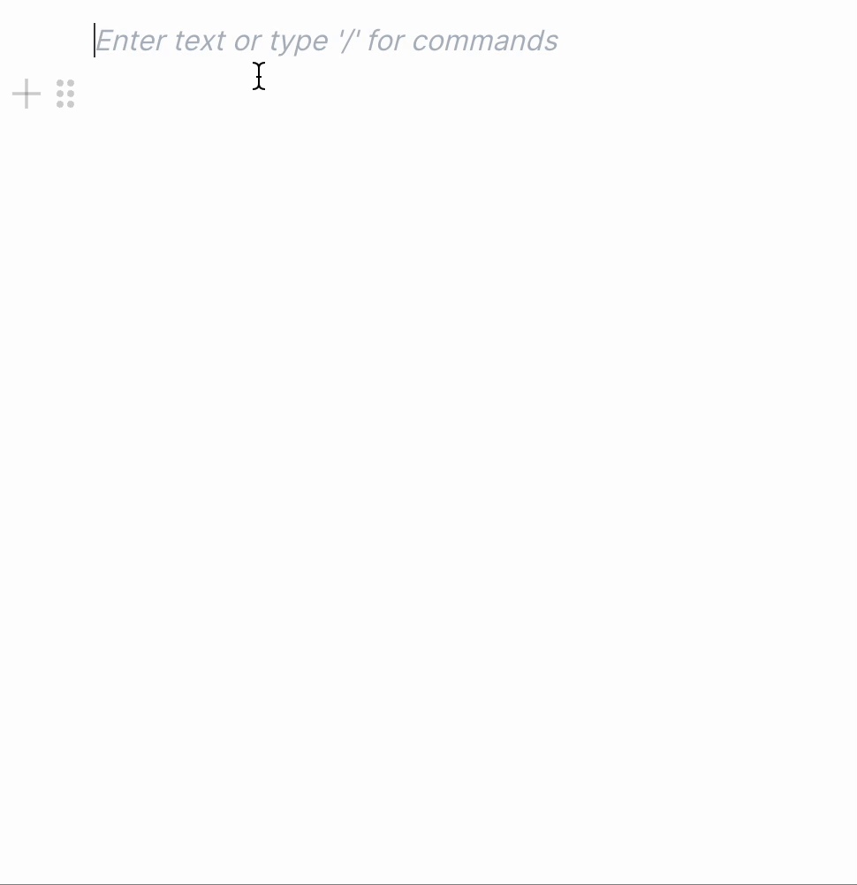
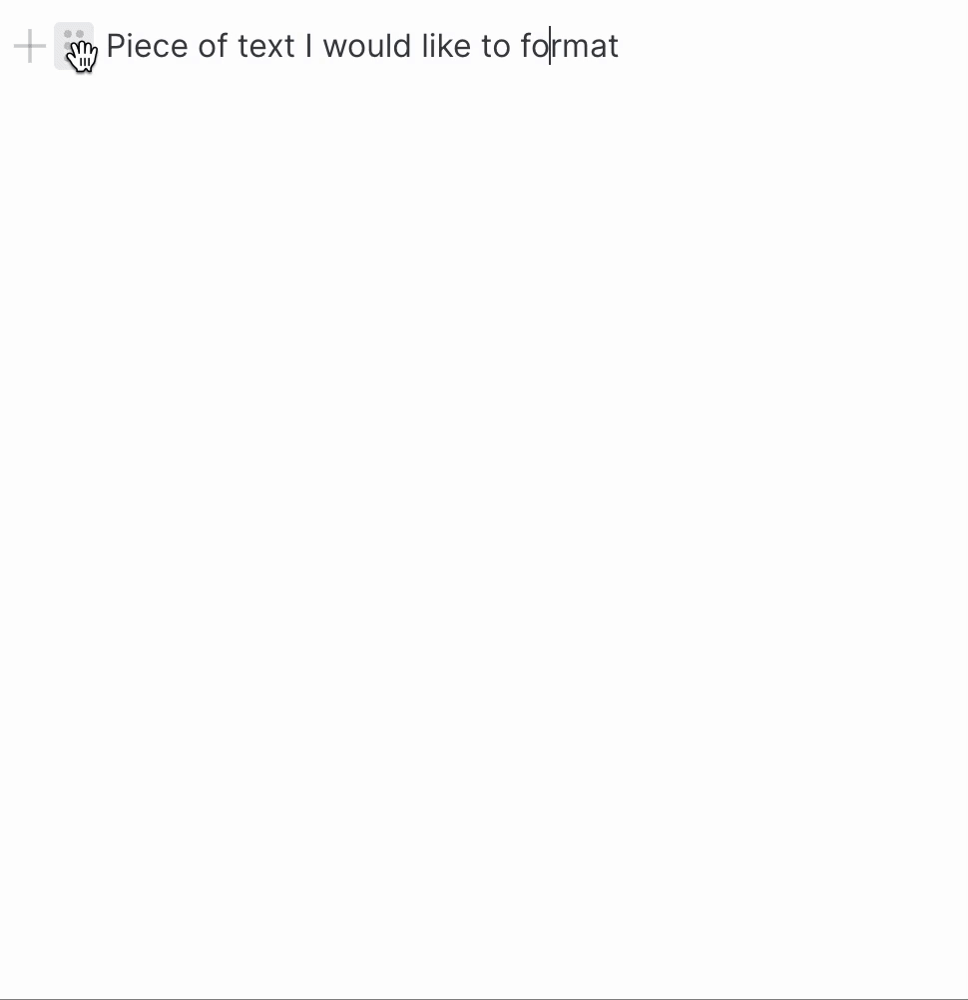

# BlockNote

**Welcome to BlockNote editor: a "Notion-style" block-based extensible text editor built on top of [Prosemirror](https://prosemirror.net/) and [Tiptap](https://tiptap.dev/).**

# Live demo

Play with the editor @ [https://blocknote-main.vercel.app/](https://blocknote-main.vercel.app/).

(Source in [examples/editor](/examples/editor))

# Example code (React)

```typescript
import { EditorContent, useEditor } from "@blocknote/core";
import "@blocknote/core/style.css";

function App() {
  const editor = useEditor({
    onUpdate: ({ editor }) => {
      // Log the document to console on every update
      console.log(editor.getJSON());
    },
  });

  return <EditorContent editor={editor} />;
}
```

# Features

BlockNote comes with a number of features and components to make it easy to embed a high-quality block-based editor in your app:

### Animations:


### Helpful placeholders:



### Drag and drop blocks:


### Nesting / indentation with tab and shift+tab:


### Slash (/) menu:



### Format menu:



# Contributing

Directory structure:

```
blocknote
├── packages/core       - The editor that can be used in other applications
├── examples/editor     - The main example application that just embeds the editor
└── tests               - Playwright end to end tests
```

## Running

To run the project, open the command line in the project's root directory and enter the following commands:

    # Install all required npm modules for lerna, and bootstrap lerna packages
    npm install

    # Start the example project
    npm start

## Adding packages

- Add the dependency to the relevant `package.json` file (packages/xxx/package.json)
- run `npm run install-new-packages`
- Double check `package-lock.json` to make sure only the relevant packages have been affected

# Credits ❤️

BlockNote builds directly on two awesome projects; [Prosemirror](https://prosemirror.net/) by Marijn Haverbeke and [Tiptap](https://tiptap.dev/). Consider sponsoring those libraries when using BlockNote: [Prosemirror](https://marijnhaverbeke.nl/fund/), [Tiptap](https://github.com/sponsors/ueberdosis).

BlockNote is built as part of [TypeCell](https://www.typecell.org). TypeCell is proudly sponsored by the renowned [NLNet foundation](https://nlnet.nl/foundation/) who are on a mission to support an open internet, and protect the privacy and security of internet users. Check them out!

<a href="https://nlnet.nl"></a>
