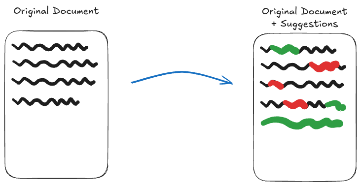
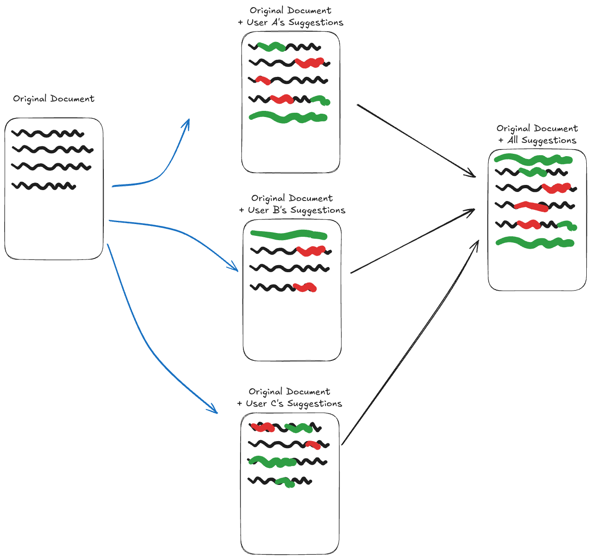

# Storing changes as separate _document histories_ and diffs between them

Branched document histories is the idea that you can think of a suggestion of the document as having a "different history" of a document; where, a user made some changes to a copy of the document, which can later be merged back into the document somehow.

This would work very similarly to how the version diffing would work, and is intended to mostly re-use that logic.

## Implementation

To implement this, each user who suggests changes is given a separate document which they would have access to modify the contents of. This allows the user to own that document, while guaranteeing the original document stays unmodified.

When viewing what suggestions are available on a document, the frontend would have to "collect" the suggestions from each suggestion document, apply an updates those documents may not have seen yet, diff the documents to see what changes are in the suggestion document compared to the original document and finally display those changes to the user in the original document somehow.

## Pros

- Allows reuse of the version comparison logic
- A suggestion-only user is easy to implement, since they can be given access to a copy of the Ydoc, without affecting the original document
- Guaranteed that a suggestion cannot affect the original document without any server-side inspection of the content

## Cons

- Requires diffing an entire YDoc to derive what the change actually was
  - Performance might be an issue especially since it scales by number of users who suggest
- Unclear whether to diff the content at Y.js level or to diff the JSON document
  - If diffing at the Y.js level, not everyone uses Y.js and we may not want to pay that bundle/complexity cost
  - If diffing on the JSON, are we just recreating the version snapshot comparison and duplicating the work involved?
- Complicated to setup
  - Storage of the branched versions need to be kept up to date (i.e. must apply new updates since the branch) and need to store that document separately

## To be determined

- How can we sync the branched versions?
- How does the editor know to edit the root document versus the suggestion document?
  - It is unclear how to have 2 sources of truth for editing a single ProseMirror document.
  - Who is responsible for synchronizing the change made?
    - If it is the editor, then this potentially complicates a lot of the ProseMirror logic, forcing it to be "suggestion aware"
    - If it is y-prosemirror, as the sync layer, how do we support different backends than Y.js? We'd still like to have suggestions usable on editors without Y.js
