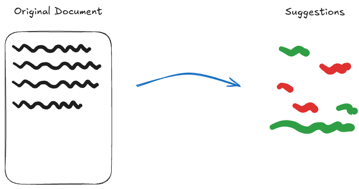

# Storing changes as _patches_ to a document

Say that you kept a separate note where you write what your changes would be. For example, you could probably write on your note, "change paragraph #2 to be paragraph #5", and apply this patch at a later date, assuming the content did not change.

This is sort of along the lines of what Prosemirror suggests, to track changes in a separate data structure and attempt to apply the change at a later point if possible. This is the essence of the idea of Operational Transforms(OT).

## Implementation Details

One easy implementation of this is to have a suggestion be a serialization of a [Prosemirror Transform](https://prosemirror.net/docs/ref/#transform). This transform can be [rebased](https://prosemirror.net/docs/guide/#transform.rebasing) through document transformations, to ensure that it's positions are not invalidated. Unfortunately, using this with the current y-prosemirror implementation, makes this approach untenable, as the positions will almost immediately be invalidated. A workaround may be to explore using [relative positions](https://docs.yjs.dev/api/relative-positions) as the anchors to reference for these positions instead of the absolute positions that prosemirror uses. But, this would require some research & testing.

### Pros

- This stores only the minimal representation of a change
- Since it is stored separately
  - it is not possible to be "lost" due to changes in the editor content.
  - it can be permission-ed separately

### Cons

- This stores the change in a separate data structure, which would need to be either maintained by mapping new positions through, or using relative positions.
- Being in a different data structure presents risk for being invalidated by changes to the document (which may not have been intentional).  Imagine moving a paragraph that had a suggestion on it, it could result in the suggestion pointing into an element which no longer exists.
