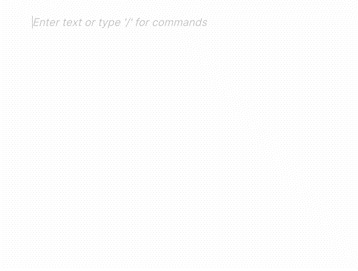

# Real-time Collaboration (multiplayer text editor)

Let's see how you can add Multiplayer capabilities to your BlockNote setup, and allow real-time collaboration between users (similar to Google Docs):



_Try the live demo <!--[below](#live-demo) or --> on the [homepage](https://www.blocknotejs.org)_

BlockNote uses [Yjs](https://github.com/yjs/yjs) for this, and you can set it up with the `collaboration` option:

```typescript
import * as Y from "yjs";
import { WebrtcProvider } from "y-webrtc";
// ...

const doc = new Y.Doc();

const provider = new WebrtcProvider("my-document-id", doc); // setup a yjs provider (explained below)
const editor = useBlockNote({
  // ...
  collaboration: {
    // The Yjs Provider responsible for transporting updates:
    provider,
    // Where to store BlockNote data in the Y.Doc:
    fragment: doc.getXmlFragment("document-store"),
    // Information (name and color) for this user:
    user: {
      name: "My Username",
      color: "#ff0000",
    },
  },
  // ...
});
```

## Yjs Providers

When a user edits the document, an incremental change (or "update") is captured and can be shared between users of your app. You can share these updates by setting up a _Yjs Provider_. In the snipped above, we use [y-webrtc](https://github.com/yjs/y-webrtc) which shares updates over WebRTC (and BroadcastChannel), but you might be interested in different providers for production-ready use cases.

- [PartyKit](https://www.partykit.io/) A serverless provider that runs on Cloudflare
- [Hocuspocus](https://www.hocuspocus.dev/) open source and extensible Node.js server with pluggable storage (scales with Redis)
- [y-websocket](https://github.com/yjs/y-websocket) provider that you can connect to your own websocket server
- [y-indexeddb](https://github.com/yjs/y-indexeddb) for offline storage
- [y-webrtc](https://github.com/yjs/y-webrtc) transmits updates over WebRTC
- [Matrix-CRDT](https://github.com/yousefED/matrix-crdt) syncs updates over Matrix (experimental)
- [Nostr-CRDT](https://github.com/yousefED/nostr-crdt) syncs updates over Nostr (experimental)

## Partykit

For development purposes, you can use our Partykit server to test collaborative features. Replace the `WebrtcProvider` provider in the example below with a `YPartyKitProvider`:

```typescript
// npm install y-partykit@beta
import YPartyKitProvider from "y-partykit/provider";

const provider = new YPartyKitProvider(
  "blocknote-dev.yousefed.partykit.dev",
  // use a unique name as a "room" for your application:
  "your-project-name",
  doc
);
```

To learn how to set up your own development / production servers, check out the [PartyKit docs](https://github.com/partykit/partykit) and the [BlockNote + Partykit example](https://github.com/partykit/partykit/tree/main/examples/blocknote).

<!-- # Live demo

Below, two editors are connected to each other. Note that anything you type is shared live with other visitors of this webpage, so be friendly ;)

::: sandbox {template=react-ts}

```typescript /App.tsx
import { BlockNoteEditor } from "@blocknote/core";
import { BlockNoteView, useBlockNote } from "@blocknote/react";
import YPartyKitProvider from "y-partykit/provider";
import * as Y from "yjs";
import "@blocknote/core/style.css";

const doc = new Y.Doc();
const provider = new YPartyKitProvider(
  "blocknote-dev.yousefed.partykit.dev",
  // use a unique name as a "room" for your application:
  "docs-demo",
  doc
);

export default function App() {
  // Creates a new editor instance.
  const editor: BlockNoteEditor | null = useBlockNote({
    collaboration: {
      provider,
      fragment: doc.getXmlFragment("document-store"),
      user: {
        name: "User 1",
        color: "#ff0000",
      },
    },
  });

  // Renders the editor instance using a React component.
  return <BlockNoteView editor={editor} />;
}
```

:::

::: sandbox {template=react-ts}

```typescript /App.tsx
import { BlockNoteEditor } from "@blocknote/core";
import { BlockNoteView, useBlockNote } from "@blocknote/react";
import YPartyKitProvider from "y-partykit/provider";
import * as Y from "yjs";
import "@blocknote/core/style.css";

const doc = new Y.Doc();
const provider = new YPartyKitProvider(
  "blocknote-dev.yousefed.partykit.dev",
  // use a unique name as a "room" for your application:
  "docs-demo",
  doc
);

export default function App() {
  // Creates a new editor instance.
  const editor: BlockNoteEditor | null = useBlockNote({
    collaboration: {
      provider,
      fragment: doc.getXmlFragment("document-store"),
      user: {
        name: "User 2",
        color: "#00ff00",
      },
    },
  });

  // Renders the editor instance using a React component.
  return <BlockNoteView editor={editor} />;
}
```

::: -->
