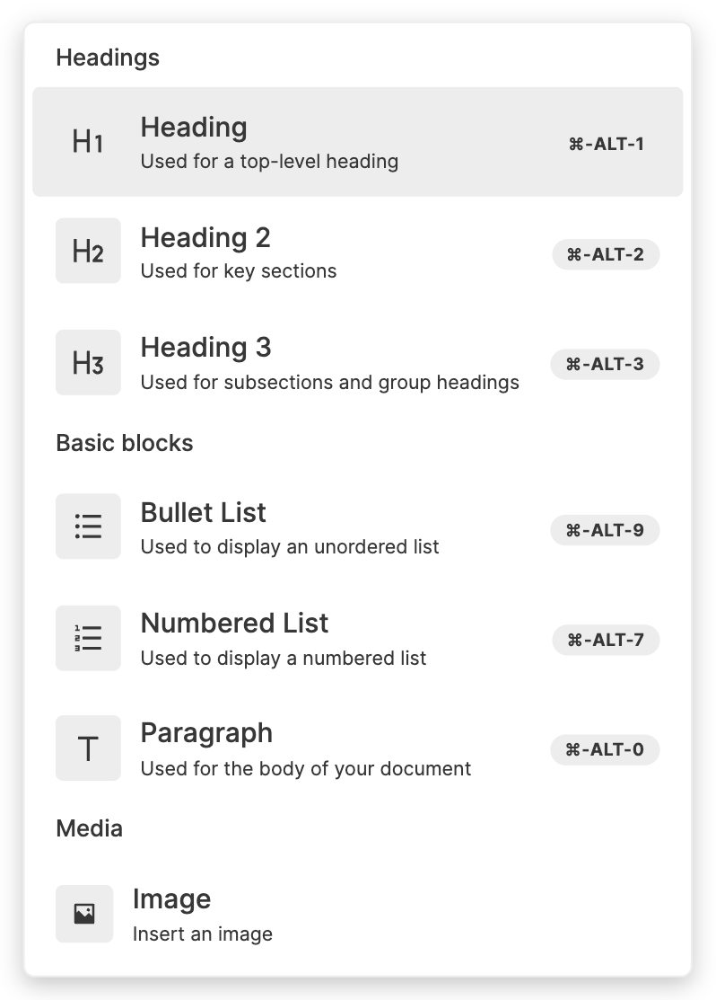

# Slash Menu

The Slash Menu is the list of commands which shows up whenever you type the "/" (slash) character, or when you click the "+" button in the [Side Menu](/docs/side-menu):

<!--  -->



## Slash Menu Items

In the options passed to `useBlockNote`, there's a field:

`slashMenuItems: ReactSlashMenuItem[]`

Which you can use to customize the contents of the Slash Menu. Let's take a look at what's in a `ReactSlashMenuItem`:

```typescript
type ReactSlashMenuItem = {
  name: string;
  execute: (editor: BlockNoteEditor) => void;
  aliases: string[];
  group: string;
  hint?: string;
  shortcut?: string;
};
```

`name:` The item's name, which is the same string you see displayed in the menu, e.g. "Heading" or "Paragraph".

`execute:` A function that runs when the item is selected.

`aliases:` Other names for the item, which as used as shortcuts for search.

`group:` The name of the group the item belongs to, e.g. "Headings" or "Basic Blocks".

`hint:` A short phrase to describe what the item is for, which is displayed below its name.

`shortcuts:` A keyboard shortcut which can be used to run the item's `execute` function outside the Slash Menu.

## Default Items

BlockNote comes with a variety of built-in Slash Menu items, which are used to change the type of the block containing the text cursor. If you don't pass anything to `slashMenuItems`, BlockNote will use these to set the Slash Menu contents.

If you want to change, remove & reorder the default items , you first import and copy them to a new array. From there, you can edit the array how you like, then pass it to `useBlockNote`:

```typescript
import { defaultSlashMenuItems } from "@blocknote/core";
import { BlockNoteView, useBlockNote } from "@blocknote/react";
import "@blocknote/core/style.css";

function App() {
  const newSlashMenuItems: ReactSlashMenuItem[] = defaultSlashMenuItems;

  // Edit newSlashMenuItems
  ...

  const editor = useBlockNote({ slashMenuItems: newSlashMenuItems });

  return <BlockNoteView editor={editor} />;
}
```

## Custom Items

You can also create your own, custom menu items too, as you can see in the example below. The new item, with the name "Insert Hello World", inserts a new block below with "Hello World" in bold:

::: sandbox {template=react-ts}

```typescript /App.tsx
import {
  Block,
  BlockNoteEditor,
  PartialBlock
} from "@blocknote/core";
import {
  BlockNoteView,
  defaultReactSlashMenuItems,
  ReactSlashMenuItem,
  useBlockNote
} from "@blocknote/react";
import "@blocknote/core/style.css";
import { HiOutlineGlobeAlt } from "react-icons/all";

export default function App() {
  const insertHelloWorld = (editor: BlockNoteEditor) => {
    const currentBlock: Block = editor.getTextCursorPosition().block;
    const helloWorldBlock: PartialBlock = {
      type: "paragraph",
      content: [{type: "text", text: "Hello World", styles: {bold: true}}],
    };

    editor.insertBlocks([helloWorldBlock], currentBlock, "after");
  };

  const insertHelloWorldItem: ReactSlashMenuItem =
    new ReactSlashMenuItem(
      "Insert Hello World",
      insertHelloWorld,
      ["helloworld", "hw"],
      "Other",
      <HiOutlineGlobeAlt size = {18}
  />,
  "Used to insert a block with 'Hello World' below."
)

  const editor = useBlockNote({
    slashCommands: [
      ...defaultReactSlashMenuItems,
      insertHelloWorldItem
    ]
  });

  return <BlockNoteView editor = {editor}
  />;
}
```

:::

If you're confused about what's happening inside `execute`, head to [Introduction to Blocks](/docs/blocks), which will guide you through manipulating blocks in the editor using code. When creating your own `ReactSlashMenuItem`s, also make sure you use the class constructor like in the demo. 
